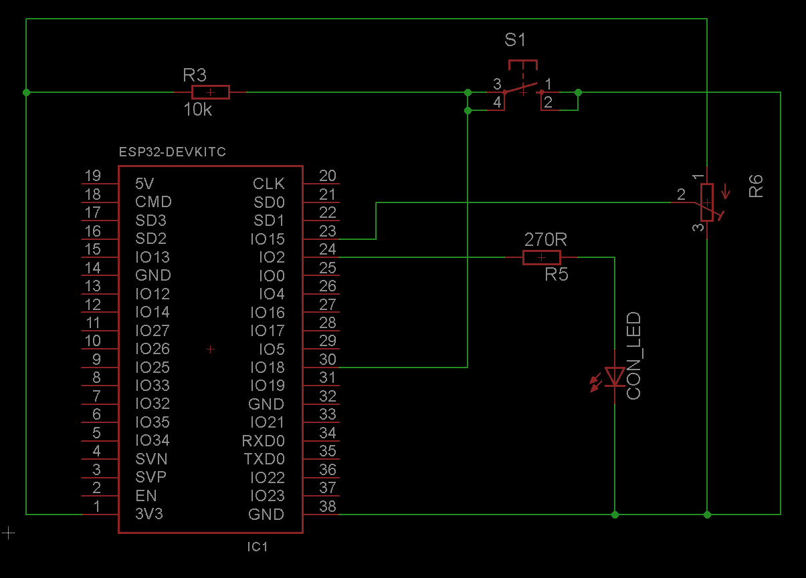

# Bar- and Linegraph

This example demonstrates how the Bargraph and the Linegraph property could be used with the [LaRoomy Api](https://api.laroomy.com/).

## Hardware

- 1 LED for the connection status indication
- 1 hardware button to switch the data of the Bar- or the Linegraph respectively
- 1 Potentiometer to modify the current value for the live output on the example properties

