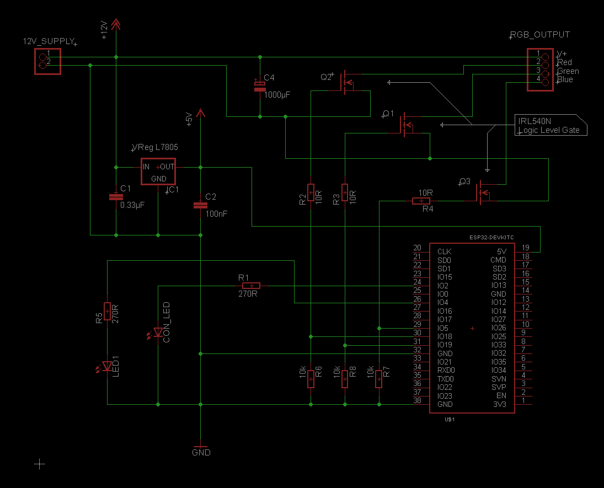

# RGB Selector and Extended Level Selector

Example for the usage of the RGB-Selector and the ExtendedLevelSelector.

## Hardware
- The system is supplied by 12V input. The 5V supply for the dev board is generated by a common voltage regulator.
- 2 LEDs are used. One to indicate the connection status and the other one to display the output of the ExtendedLevelSelector.
- 3 Pins are used for the RGB output. Three logic level FETs are used to transform the signal to working voltage.

## What the program does

In this program example four device properties are added: a RGBSelector, an OptionSelector, an ExtendedLevelSelector and a switch. 

With the ExtendedLevelSelector a level can be selected by the app user. This is reported in the respective method of the remote events implementation. 
With the switch the tracking type of the ExtendedLevelSelector can be selected. 
Full-Tracking means that for every single step the selector is tracked, a message will be sent. 
On the other hand if full tracking is not set, messages will only be sent if the tracking starts or ends. 

With the RGB Selector a color or a color program could be selected in the app. This is reported through the callback method in the remote events implementation. To control the RGB output on the hardware side, the helper class [RGBControl](https://api.laroomy.com/p/helper-classes.html#laroomyApiRefMIDRGBCtrl) is used. Note that the class need to be called periodically in the main loop to work right. 

With the OptionSelector the setup of a custom color table for the transition program of the RGBControl class is demonstrated.

## Resources
- [RGBControl helper class](https://api.laroomy.com/p/helper-classes.html#laroomyApiRefMIDRGBCtrl)
- [Defining the state of a RGBSelector](https://api.laroomy.com/p/property-state-classes.html#propStateClsUsage)
