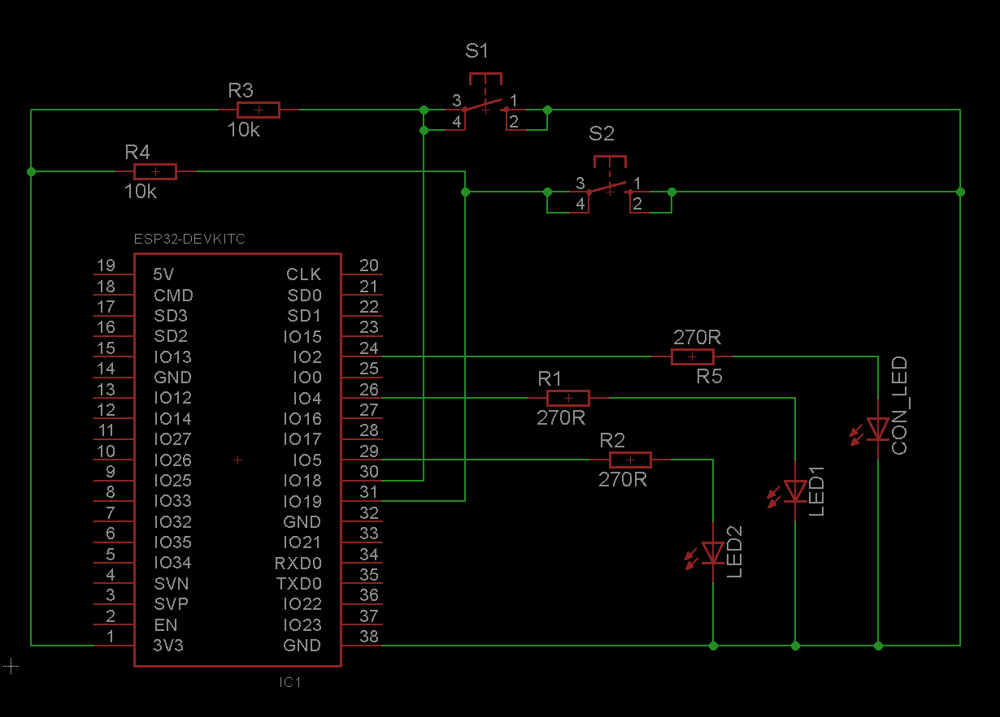

## Simple Example

The simple example demonstrates the basic usage of the [LaRoomy Api](https://api.laroomy.com).
This is a little starter example to get an overview of the implementation. Two types of simple device properties are used, buttons and switches.

### Hardware
---
In this example three LEDs and two hardware buttons are used. One to indicate the connection status and the other two LEDs are for the remote control. The hardware buttons are also intended to control the LEDs.

### What the program does
---

Buttons:
- If the first button is pressed, the respective event will be raised in the [LaRoomy Callback Interface](https://api.laroomy.com/p/laroomy-app-callback.html).
In this example the event is used to update the property.
- The second button does nothing, only a message will be reported through the serial monitor.

Switches:
Every switch is used to control a LED. But the hardware buttons can also control the LEDs. This is a demonstration how to keep the alignment between app-state and hardware-state. When a hardware button is used to change the state of a LED, this must be reported to the LaRoomy Api to keep the internal state in the same condition as the real hardware state. When you press the hardware button while the app is connected, look at the switch inside of the app, it will update in respect to the state of the LEd.
