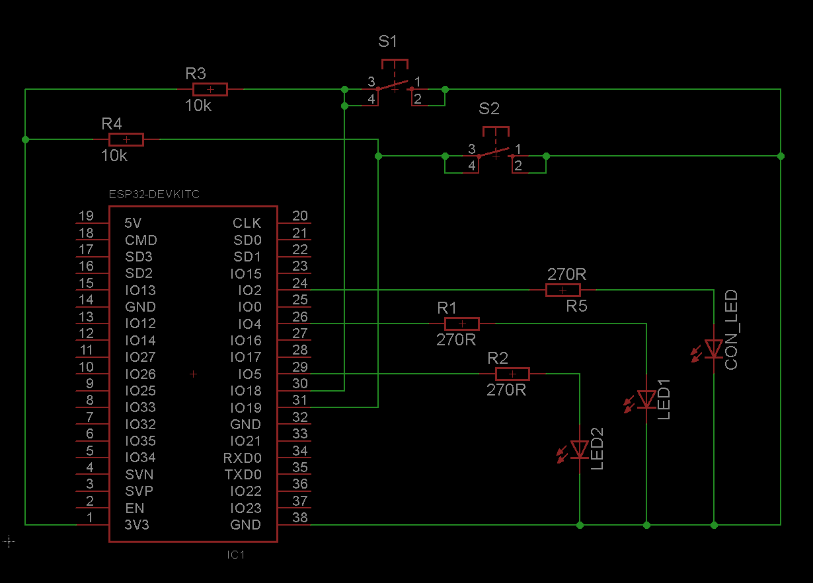

# TimeSelector, TimeFrameSelector and DateSelector

In this example the selectors for time and date are demonstrated.

## Hardware

- Three LEDs are used in this example. One as connection status indication. The other LEDs are for time demonstration
- The schematic shows the common test circuit - not all elements are used

## What the program does

When the device gets connected and all properties are completely loaded, a time request is sent to the app. When the response is received, the current date is requested. Both, the time and date are displayed together in the TextDisplay property to monitor the internal time for testing.

With the switch property the first LED can be switched on. To test the TimeSelector property a time can be selected, this time is the disable time for the first LED, when the selected time equals the current time, the LED is automatically switched off.

The second LED is activated when the current time is in the selected time-frame of the TimeFrameProperty. If not, the LED is switched off.

When a date is selected in the DateSelector property, the result is printed in the output of the serial monitor.

## Resources

- [TimeSelector](https://api.laroomy.com/p/property-classes.html#laroomyApiRefMIDTimeSel)
- [TimeFrameSelector](https://api.laroomy.com/p/property-classes.html#laroomyApiRefMIDTimeFrameSel)
- [DateSelector](https://api.laroomy.com/p/property-classes.html#laroomyApiRefMIDDateSel)
