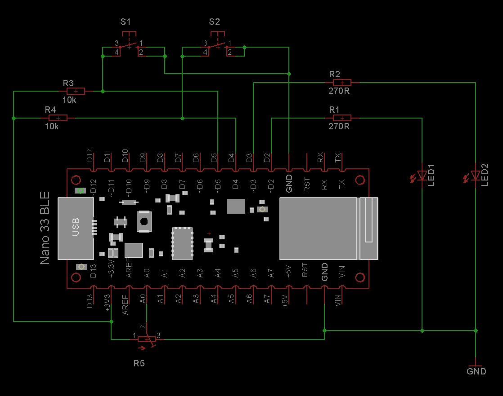

# All Simple Properties

This example demonstrates all **Simple Properties** that could be used with the [LaRoomy Api](https://api.laroomy.com/).

## Hardware

In this example two LEDs, two hardware buttons and one potentiometer are used.

## What the program does

Button:
- If the [Button-Property](https://api.laroomy.com/p/property-classes.html#laroomyApiRefMIDButton) is pressed inside the app, the callback updates the TextDisplay property to demonstrate property updating.

Switch:
- The [Switch-Property](https://api.laroomy.com/p/property-classes.html#laroomyApiRefMIDSwitch) controls the first LED. The first hardware button controls also the first LED - to demonstrate hardware <> app-state alignment

LevelSelector:
- The [LevelSelector](https://api.laroomy.com/p/property-classes.html#laroomyApiRefMIDLevelSel) controls the analog output for the second LED

LevelIndicator:
- The [LevelIndicator](https://api.laroomy.com/p/property-classes.html#laroomyApiRefMIDLevelInd) displays the current input voltage on the potentiometer input pin as a percentage value

TextDisplay:
- The [TextDisplay](https://api.laroomy.com/p/property-classes.html#laroomyApiRefMIDTextDP) property is used to display messages. When the first button is pressed, the content of the element is changed from remote side. 

OptionSelector:
- The [OptionSelector](https://api.laroomy.com/p/property-classes.html#laroomyApiRefMIDOptionSel) does nothing explicitly. When the property has changed inside the app, the callback will be raised and a message will be displayed through the serial monitor

Other:
- The second hardware button is used to demonstrate how a important notification could be presented to the user by invoking the [sendUserMessage](https://api.laroomy.com/p/laroomy-api-class.html#laroomyApiRefMSendUserMsg) method on the LaRoomy Api

