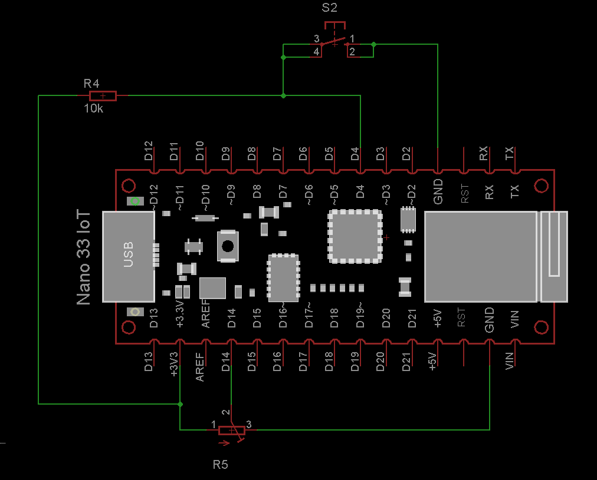

# Bar- and Linegraph

This example demonstrates how the Bargraph and the Linegraph property could be used with the [LaRoomy Api](https://api.laroomy.com/).

## Hardware

- 1 LED for the connection status indication
- 1 hardware button to switch the data of the Bar- or the Linegraph
- 1 Potentiometer to modify the current value for the live output on the example properties

## What the program does

Four properties are added to the LaRoomy Api, two Bargraphs and two Linegraphs. They are arranged in two property-groups.

The first group contains the properties for the live output of the measured value on the pin with the potentiometer. If the device is connected to the app, the value will be displayed in the respective property page if opened.

The second group contains properties which are displaying static data. With the hardware button the visual state of the static properties could be modified. Whereas the underlying data of the Bargraph is completetly changed, the static Linegraph is only modified by changing the grid, not the underlying data, to achieve a kind of zoom function.

