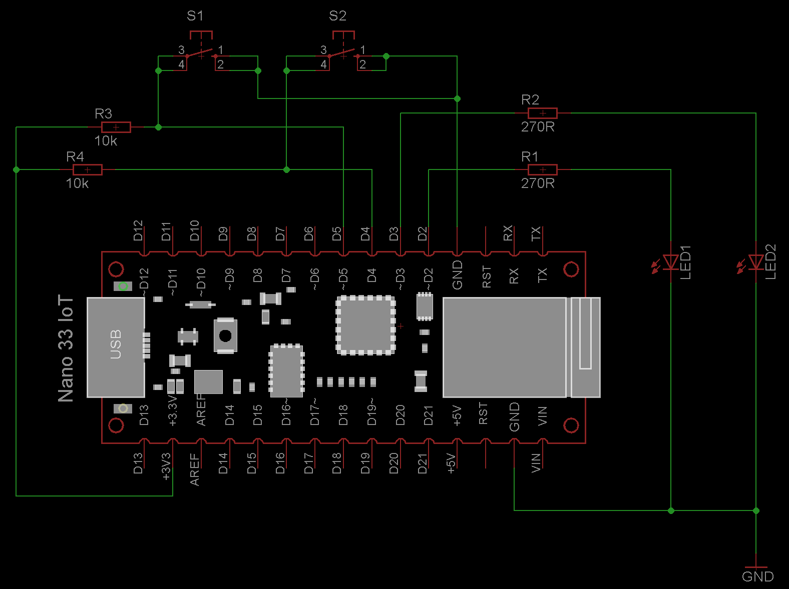

# Device Binding Implementation

This example shows how an external processing of the device binding could be achieved.

## Hardware
Three LEDs are used in this example. One to indicate the connection status. 
The remaining LEDs can be toggled by the two button properties. 
The schematic shows the common test circuit - not all elements are used.

## What the program does

In the definition of the remote event callback the [onBindingTransmissionReceived](https://api.laroomy.com/p/laroomy-app-callback.html#laroomyApiRefMIDBNDTransRec) method is overwritten. It is invoked every time the user of the app enables or disables the device binding or when the connection is initially established and athentication is required. To keep the current binding key and the parameter which indicates if binding is required or not, it must be saved permanently. When the program starts and binding was previously enabled, the LaRoomy API must be notified by calling the [setDeviceBindingAuthenticationRequired](https://api.laroomy.com/p/laroomy-api-class.html#laroomyApiRefMSetBindReqired) method.
In this example the [DeviceBindingController](https://api.laroomy.com/p/helper-classes.html#laroomyApiRefMIIDBCtrler) is used to implement the whole  functionality. It takes also responsibility of data storage.

## Resources

- [What is device binding?](https://api.laroomy.com/2023/02/ways-to-implement-device-binding.html)
- [DeviceBindingController class](https://api.laroomy.com/p/helper-classes.html#laroomyApiRefMIIDBCtrler)
