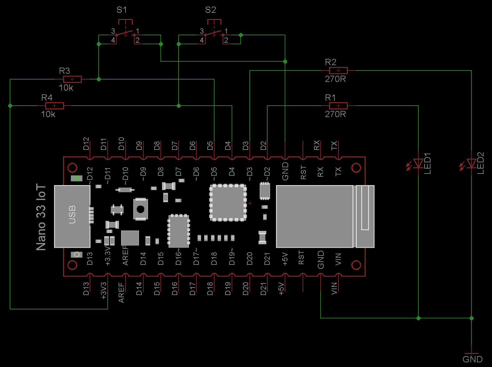

# StringInterrogator and TextListPresenter

This example demonstrates the usage of the StringInterrogator and TextListPresenter property.

## Hardware

- The built-in LED indicates the connection status
- Two hardware buttons are used to add some items to the TextListPresenter

The example schematic shows the common test circuit - not all elements are used.

## How the program works

When the user has confirmed the input data on the StringInterrogator, the respective callback method of the remote handler implementation is called. In this program the data the user has entered is added as a TextListPresenter element for demonstration. Beside that, the data is also displayed through the serial monitor.

Some other callback methods are also implemented and add elements to the TextListPresenter to show how the remote side can determine the navigational state of the app and to demonstrate that elements are saved even when the property page is not opened.

The two hardware buttons add elements to the TextListPresenter too.

## Resources

- [StringInterrogator](https://api.laroomy.com/p/property-classes.html#laroomyApiRefMIDStringIG)
- [TextListPresenter](https://api.laroomy.com/p/property-classes.html#laroomyApiRefMIDTextListP)
