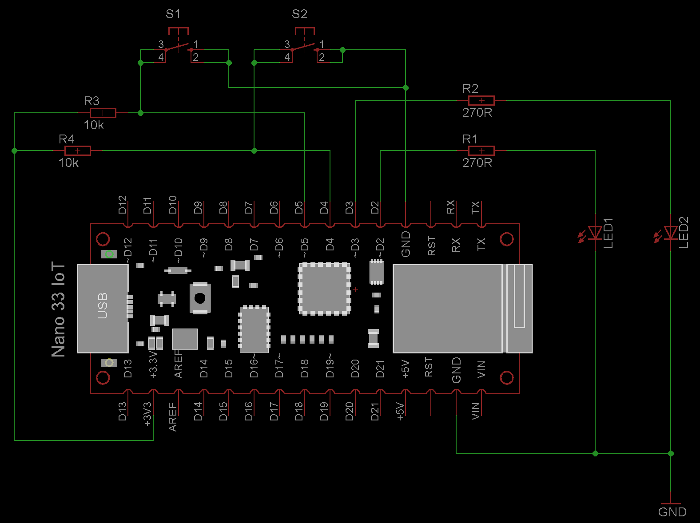

# UnlockControl and NavigatorControl

This is a demonstration program for the UnlockControl and the NavigatorControl property.

## Hardware

- Two LEDs are used in this example. They indicate the lock/unlock status of UnlockControl property
- One hardware button is used to reset the UnlockControl property

The example schematic shows the common test circuit - not all elements are used.

## What the program does

In setup, the properties are added. Note that the pin (if it was previously set) must be loaded and initially set to the state of the UnlockControl property.

If the UnlockControl property is in locked condition, the first LED is on. 
When the user unlocks the property with the correct pin, the second LED will be switched on and the first LED will be switched off. 
When the property is locked, the same is done vice versa.

The remote event callback implementation has two methods. The [onUnlockControlStateChanged](https://api.laroomy.com/p/laroomy-app-callback.html#laroomyApiRefMIDUCCtrlStateCh) is called when a lock or unlock action occurs or if a pin change action is made in the app. When the pin is saved it must be stored permanently to flash and must be recovered on next startup. In this example the [PinStorageController](https://api.laroomy.com/p/helper-classes.html#laroomyApiRefMIDPSCtrler) is used to implement the functionality.

The [onUnlockControlInvalidOperation](https://api.laroomy.com/p/laroomy-app-callback.html#laroomyApiRefMIDUCInvalidOP) method is called when a wrong pin is entered in a unlock or pin change operation. In this example this implementation is used to realize a limitation for invalid unlock attempts. When a wrong pin is entered 3 times, the program forces a back navigation and the property is updated to disabled state. So the user is not able to use the property. With the hardware button the property could be enabled again.

The Navigator property has a respective callback method in the remote event handler implementation to report when navigation buttons are pressed inside the app. Messages are sent for a touch down and a release for each arrow button. Also multi touch is supported. The callback method displays the actions via serial monitor.

## Resources
- [PinStorageController](https://api.laroomy.com/p/helper-classes.html#laroomyApiRefMIDPSCtrler)
- [UnlockControl property](https://api.laroomy.com/p/property-classes.html#laroomyApiRefMIDUnlockCtrl)
- [NavigatorControl property](https://api.laroomy.com/p/property-classes.html#laroomyApiRefMIDNavCtrl)
