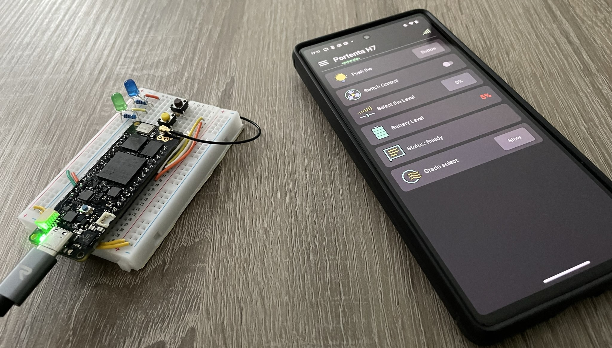

## Example projects for the STM32 platform / Portenta H7

This is a collection of examples to demonstrate the basic features and usage of the [LaRoomy Api](https://api.laroomy.com/) with a Portenta H7 board.
All Examples come with a schematic to show the experimental setup.

Detailed descriptions to a particular repository can be found on the respective example page or in the code file of the example.

